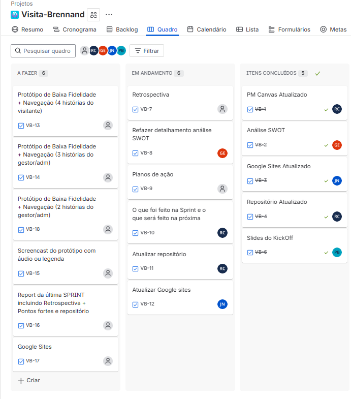
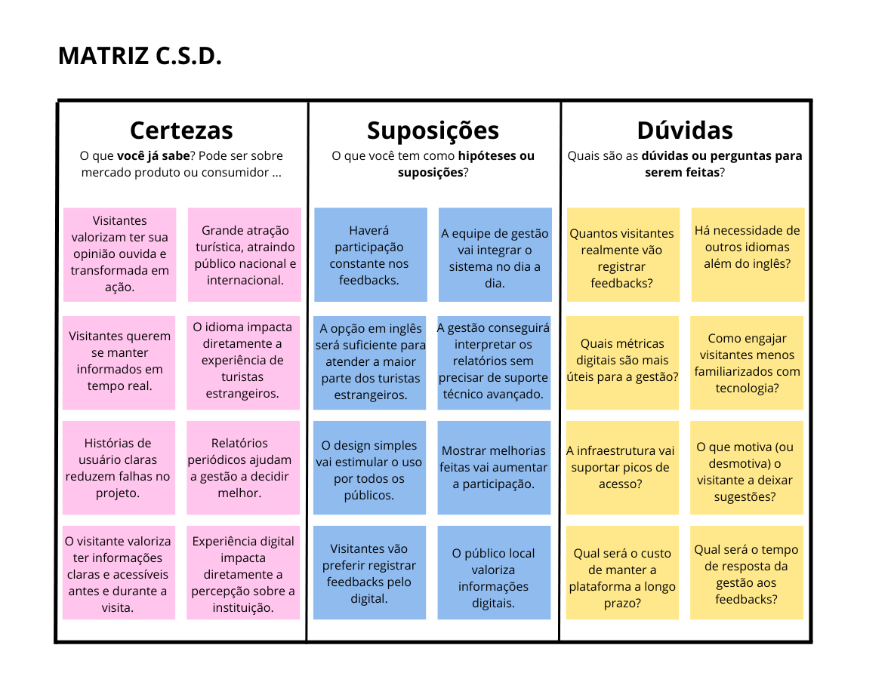
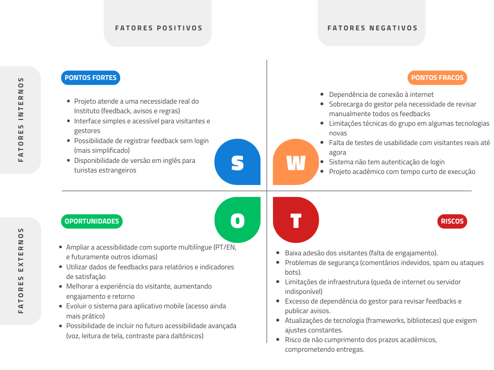

  

# Visita Brennand

O **Visita Brennand** é um projeto acadêmico desenvolvido para apoiar a gestão e a experiência dos visitantes no **Parque de Esculturas Francisco Brennand**, localizado no Recife.  

## 📌 Problemática
Atualmente, o Parque enfrenta desafios que afetam sua gestão e a experiência dos visitantes:
- **Baixa coleta de feedback**: ausência de um canal estruturado para elogios, sugestões e reclamações.  
- **Comunicação limitada com o público**: dificuldade em informar horários, regras de visitação e avisos de funcionamento.  
- **Gestão baseada em poucos dados**: falta de indicadores claros para auxiliar na tomada de decisões estratégicas.  

A solução proposta busca centralizar **feedbacks, avisos e indicadores de gestão** em uma aplicação acessível e intuitiva.

---

## 📄 Documentações e Entregas (Links)

  
  
  
  
    
    
    
    

    

## 🚀 Funcionalidades Principais 
- 📋 **Registrar Feedback de Satisfação**  
  Visitantes podem registrar notas e comentários sobre sua experiência.  

- 🔍 **Consultar Feedbacks**  
  Gestores têm acesso à lista de feedbacks para análise.  

- 📢 **Publicar Avisos de Funcionamento**  
  Administração pode cadastrar e atualizar avisos (ex.: fechamento por maré alta).  

- 👀 **Consultar Avisos Vigentes**  
  Visitantes verificam informações atualizadas sobre funcionamento do parque.  

- 💡 **Registrar Sugestões e Reclamações**  
  Canal estruturado para visitantes enviarem opiniões e melhorias.  

- 📊 **Gerar Relatórios Mensais**  
  Relatórios com indicadores de satisfação e quantidade de feedbacks.  

- 📈 **Consultar Estatísticas de Acesso**  
  Painel para gestores acompanharem dados de uso e comportamento dos visitantes.  

- 📜 **Editar Regras de Visitação**  
  Administração mantém regras sempre atualizadas e acessíveis.  

- 🌍 **Alterar Idioma**  
  Visitantes podem mudar o idioma da aplicação (ex.: Português ↔ Inglês).  

## 🛠️ Tecnologias Utilizadas (Em desenvolvimento)
- **Frontend**: Java Swing (interface gráfica) + Figma (protótipos de baixa fidelidade)  
- **Backend**: Java (Programação Orientada a Objetos, arquitetura em camadas)  
- **Banco de Dados**: H2 (em memória para testes) / PostgreSQL (persistência final)  
- **Testes**: JUnit (testes automatizados)  
- **Controle de Versão**: Git + GitHub (issues, fluxo de versionamento e entregas)  

---

## 👥 Nossa Equipe

| Nome | Funções | Email |
|------|---------|-------|
| Gustavo Jose Magina Eustachio | Desenvolvedor Back End | [gjme@cesar.school](mailto:gjme@cesar.school) |
| João Gabriel De Souza Neri | Líder do Projeto / Desenvolvedor Back End | [jgsn@cesar.school](mailto:jgsn@cesar.school) |
| Lucas Canto Santiago Da Silva | Designer / Pesquisa | [lcss@cesar.school](mailto:lcss@cesar.school) |
| Pedro Pessoa Bastos | Desenvolvedor Front End | [ppb2@cesar.school](mailto:ppb2@cesar.school) |
| Rafael Lyra Costa | Desenvolvedor Full Stack | [rlc3@cesar.school](mailto:rlc3@cesar.school) |

## 📦 Entregas

  
Quadro Jira (Semana 4)

  

---

  
Quadro Jira (Semana 5)

  

---

  
Matriz CSD

  

---

  
Análise SWOT (Atualizada)

  

---

  
PM Canvas (Atualizado)

  

